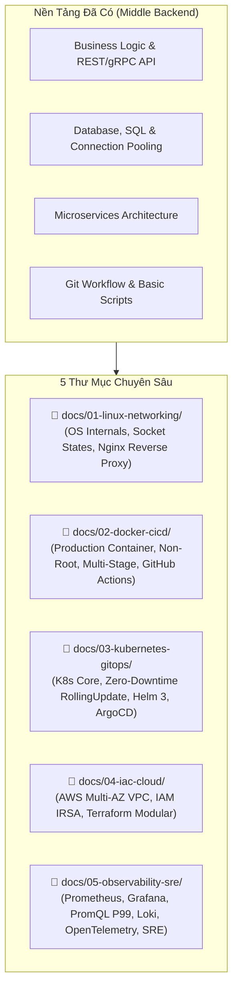

# Lộ Trình Chuyển Đổi Kỹ Sư: Backend Developer sang DevOps / Platform Engineer

Bộ tài liệu này được thiết kế dành riêng cho **Middle Backend Developer** muốn nâng cấp năng lực làm chủ toàn bộ vòng đời sản phẩm (Full Lifecycle / Platform Engineering / SRE). Toàn bộ nội dung được chia thành 5 Phase độc lập, mỗi Phase là một thư mục riêng biệt với đầy đủ các mục: **Kiến thức cốt lõi**, **Thực hành cấu hình chuẩn**, **Cạm bẫy thực tế**, và **Bài tập nghiệm thu**.

---

## 🗺️ Ma Trận Kỹ Năng & Cấu Trúc Tài Liệu

---

## 📑 Mục Lục Chi Tiết Toàn Bộ Tài Liệu

### [Phase 01: Linux Internals & Networking Thực Chiến](file:///Users/nam088/code/nam088/devop/docs/01-linux-networking)
* [01 - Kiến Thức Cần Nắm](file:///Users/nam088/code/nam088/devop/docs/01-linux-networking/01-kien-thuc-can-nam.md): Process Lifecycle, Signals (`SIGTERM`, `SIGKILL`), Systemd Unit, File Descriptors (`LimitNOFILE`), OOM-Killer, TCP States (`TIME_WAIT`, `CLOSE_WAIT`), DNS Resolution Chain.
* [02 - Bộ Lệnh Troubleshooting](file:///Users/nam088/code/nam088/devop/docs/01-linux-networking/02-bo-lenh-troubleshooting.md): `ps`, `top`, `pidstat`, `ss -tulpn`, `lsof`, bắt gói tin `tcpdump`, đo lường độ trễ chi tiết bằng `curl -w`.
* [03 - Cấu Hình Nginx Reverse Proxy Chuẩn Production](file:///Users/nam088/code/nam088/devop/docs/01-linux-networking/03-nginx-reverse-proxy.md): Tối ưu worker limits, Rate limiting, Upstream Keepalive pool, SSL/TLSv1.3, Proxy buffers.
* [04 - Các Cạm Bẫy Kinh Điển Của Backend](file:///Users/nam088/code/nam088/devop/docs/01-linux-networking/04-cam-bay-thuong-gap.md): Cạn kiệt Ephemeral Ports, Too many open files, Socket leak `CLOSE_WAIT`, Lỗi cache DNS vô tận của JVM/Node.
* [05 - Bài Tập Thực Hành & Nghiệm Thu Milestone 1](file:///Users/nam088/code/nam088/devop/docs/01-linux-networking/05-bai-tap-milestone.md): Hands-on lab dựng Systemd + Nginx Reverse Proxy + kiểm chứng kết nối.

---

### [Phase 02: Production Containerization & CI/CD Pipelines](file:///Users/nam088/code/nam088/devop/docs/02-docker-cicd)
* [01 - Kiến Thức Cần Nắm](file:///Users/nam088/code/nam088/devop/docs/02-docker-cicd/01-kien-thuc-can-nam.md): Bản chất Container, 6 Linux Namespaces, cgroups v2, Overlay2 UnionFS, tư duy Artifact bất biến (Immutable Artifact).
* [02 - Dockerfile Chuẩn Production](file:///Users/nam088/code/nam088/devop/docs/02-docker-cicd/02-dockerfile-production.md): Multi-stage builds, Distroless (<25MB) vs Alpine, chạy user Non-Root (UID 65532), `dumb-init`, xử lý `SIGTERM` Graceful Shutdown, file `.dockerignore`.
* [03 - Pipeline CI/CD Thực Chiến Với GitHub Actions](file:///Users/nam088/code/nam088/devop/docs/02-docker-cicd/03-github-actions-cicd.md): Unit Test, Quét lỗ hổng CVE tự động bằng Aqua Trivy, Docker Buildx cache `type=gha`, Push multi-arch (AMD64/ARM64) lên GHCR.
* [04 - Các Cạm Bẫy Thường Gặp Về Container & CI/CD](file:///Users/nam088/code/nam088/devop/docs/02-docker-cicd/04-cam-bay-thuong-gap.md): Nguy cơ chạy quyền root (Container Escape), cấm dùng `:latest` trên Production, rò rỉ secret vào lịch sử Layer của image.
* [05 - Bài Tập Thực Hành & Nghiệm Thu Milestone 2](file:///Users/nam088/code/nam088/devop/docs/02-docker-cicd/05-bai-tap-milestone.md): Hands-on lab tối ưu Dockerfile < 80MB và kiểm chứng Graceful Shutdown trong 2 giây.

---

### [Phase 03: Kubernetes Orchestration & GitOps](file:///Users/nam088/code/nam088/devop/docs/03-kubernetes-gitops)
* [01 - Kiến Thức Cần Nắm](file:///Users/nam088/code/nam088/devop/docs/03-kubernetes-gitops/01-kien-thuc-can-nam.md): Kiến trúc K8s Control Plane (`apiserver`, `etcd`, `scheduler`, `controller-manager`) & Worker Node (`kubelet`, `kube-proxy`, `containerd`), Pod, Deployment, Service, Ingress.
* [02 - K8s Manifest Chuẩn Production](file:///Users/nam088/code/nam088/devop/docs/03-kubernetes-gitops/02-production-manifests.md): RollingUpdate Zero-Downtime (`maxSurge: 25%`, `maxUnavailable: 0`), bộ 3 Health Probes (`startupProbe`, `readinessProbe`, `livenessProbe`), Requests & Limits, HPA v2.
* [03 - Quản Lý Ứng Dụng Với Helm 3](file:///Users/nam088/code/nam088/devop/docs/03-kubernetes-gitops/03-helm-chart-quan-tri.md): Cấu trúc Helm Chart chuẩn, tách `values-staging.yaml` và `values-prod.yaml`, template helpers, lệnh lint, dry-run, rollback.
* [04 - GitOps Hiện Đại Với ArgoCD](file:///Users/nam088/code/nam088/devop/docs/03-kubernetes-gitops/04-gitops-argocd.md): Triết lý GitOps, mô hình 2 Repositories (App Repo vs GitOps Repo), khai báo `Application` CRD, automated sync, self-healing.
* [05 - Các Cạm Bẫy Thường Gặp Trong Kubernetes](file:///Users/nam088/code/nam088/devop/docs/03-kubernetes-gitops/05-cam-bay-thuong-gap.md): Liveness Probe check Database gây Thundering Herd sập cụm, quên requests/limits dẫn đến OOM cascade, hiện tượng CPU throttling do CFS quota.
* [06 - Bài Tập Thực Hành & Nghiệm Thu Milestone 3](file:///Users/nam088/code/nam088/devop/docs/03-kubernetes-gitops/06-bai-tap-milestone.md): Hands-on lab dựng cụm K8s local `k3d`, deploy bằng Helm, cài đặt ArgoCD tự động sync.

---

### [Phase 04: Infrastructure as Code (IaC) & Cloud Architecture](file:///Users/nam088/code/nam088/devop/docs/04-iac-cloud)
* [01 - Kiến Thức Cần Nắm](file:///Users/nam088/code/nam088/devop/docs/04-iac-cloud/01-kien-thuc-can-nam.md): Kiến trúc mạng AWS Multi-AZ VPC (Public/Private/Database Subnets, IGW, NAT Gateway), Quản trị IAM, IRSA (IAM Roles for Service Accounts) loại bỏ static credentials.
* [02 - Cấu Trúc Dự Án Terraform Chuẩn Doanh Nghiệp](file:///Users/nam088/code/nam088/devop/docs/04-iac-cloud/02-cau-truc-du-an-terraform.md): Phân tách thư mục `modules/` và `environments/`, Remote State trên S3 có mã hóa và DynamoDB State Locking.
* [03 - Code Mẫu Hạ Tầng Terraform](file:///Users/nam088/code/nam088/devop/docs/04-iac-cloud/03-code-mau-ha-tang.md): Mã nguồn HCL hoàn chỉnh cho VPC Module, Subnets, Route Tables, NAT Gateway, và Security Group Least Privilege giữa App và Database.
* [04 - Các Cạm Bẫy Thường Gặp Về Cloud & IaC](file:///Users/nam088/code/nam088/devop/docs/04-iac-cloud/04-cam-bay-thuong-gap.md): Mở Database ra Public `0.0.0.0/0`, commit `terraform.tfstate` lộ credentials, hardcode Access Key vào container, ClickOps gây Configuration Drift.
* [05 - Bài Tập Thực Hành & Nghiệm Thu Milestone 4](file:///Users/nam088/code/nam088/devop/docs/04-iac-cloud/05-bai-tap-milestone.md): Hands-on lab viết module VPC và kiểm thử trên LocalStack hoặc AWS Free Tier.

---

### [Phase 05: Observability & SRE Practice](file:///Users/nam088/code/nam088/devop/docs/05-observability-sre)
* [01 - Kiến Thức Cần Nắm](file:///Users/nam088/code/nam088/devop/docs/05-observability-sre/01-kien-thuc-can-nam.md): 3 trụ cột (Metrics, Logs, Traces), 4 Golden Signals (Latency, Traffic, Errors, Saturation), Bộ thuật ngữ SLI, SLO, SLA, Error Budget.
* [02 - Prometheus & PromQL Thực Chiến](file:///Users/nam088/code/nam088/devop/docs/05-observability-sre/02-prometheus-promql.md): 4 loại metric (`Counter`, `Gauge`, `Histogram`, `Summary`), cấu hình Backend `/metrics`, công thức PromQL chuẩn tính RPS, Error Rate %, Latency P95/P99.
* [03 - Quản Trị Log Tập Trung & Distributed Tracing](file:///Users/nam088/code/nam088/devop/docs/05-observability-sre/03-logging-tracing.md): Grafana Loki + LogQL siêu tiết kiệm chi phí, OpenTelemetry SDK, chuẩn W3C `traceparent` (Trace ID, Span ID), biểu đồ Gantt Chart trên Grafana Tempo.
* [04 - Hệ Thống Cảnh Báo Chuẩn SRE Với Alertmanager](file:///Users/nam088/code/nam088/devop/docs/05-observability-sre/04-canh-bao-alertmanager.md): Nguyên tắc Symptom-based alerting, file cấu hình `PrometheusRule`, điều hướng cảnh báo tới Slack/Telegram.
* [05 - Các Cạm Bẫy Thường Gặp Về Giám Sát & SRE](file:///Users/nam088/code/nam088/devop/docs/05-observability-sre/05-cam-bay-thuong-gap.md): Thảm họa High-Cardinality nhãn Prometheus làm sập server, lộ lọt dữ liệu nhạy cảm PII trong Log, bẫy đo lường trung bình (Average vs P99).
* [06 - Bài Tập Thực Hành & Nghiệm Thu Milestone 5](file:///Users/nam088/code/nam088/devop/docs/05-observability-sre/06-bai-tap-milestone.md): Hands-on lab dựng stack Prometheus + Grafana qua Docker Compose và thiết kế Dashboard 4 Golden Signals.
