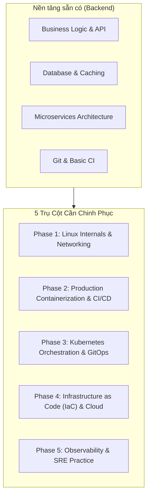

# Lộ Trình Chuyển Đổi Kỹ Sư: Backend Developer sang DevOps / Platform Engineer

Tài liệu này được thiết kế dành riêng cho **Middle Backend Developer** muốn nâng cấp năng lực làm chủ toàn bộ vòng đời sản phẩm (Full Lifecycle / Platform Engineering / SRE). Lộ trình tập trung vào thực chiến, chuẩn production, không lý thuyết lan man.

---

## 🗺️ Ma Trận Kỹ Năng (Backend vs DevOps Focus)

---

## 📑 Chi Tiết 5 Giai Đoạn (Phases)

| Phase | Trọng tâm | Công cụ chủ lực | Mục tiêu đầu ra (DoD) | Tài liệu chi tiết |
| :--- | :--- | :--- | :--- | :--- |
| **01** | **Linux & Networking** | `systemd`, `cgroups`, `ss`, `tcpdump`, `Nginx` | Tự dựng reverse proxy, tối ưu kernel limits, debug network bottlenecks | [docs/01-linux-networking.md](file:///Users/nam088/code/nam088/devop/docs/01-linux-networking.md) |
| **02** | **Docker & CI/CD** | Multi-stage Docker, GitHub Actions, Trivy | Image nhỏ gọn (<80MB), non-root, pipeline tự động test/build/scan | [docs/02-docker-cicd.md](file:///Users/nam088/code/nam088/devop/docs/02-docker-cicd.md) |
| **03** | **Kubernetes & GitOps** | K3d/Kind, K8s Core, Helm 3, ArgoCD | Đóng gói Helm chart, tự hồi phục/auto-scale, deploy tự động qua Git | [docs/03-kubernetes-gitops.md](file:///Users/nam088/code/nam088/devop/docs/03-kubernetes-gitops.md) |
| **04** | **IaC & Cloud Architecture** | Terraform, AWS (VPC, IAM, EKS, RDS) | Quản lý hạ tầng 100% bằng code, VPC chuẩn HA, zero manual click | [docs/04-iac-cloud.md](file:///Users/nam088/code/nam088/devop/docs/04-iac-cloud.md) |
| **05** | **Observability & SRE** | Prometheus, Grafana, Loki, OpenTelemetry | Giám sát 4 Golden Signals, trace request qua các service, alert tự động | [docs/05-observability-sre.md](file:///Users/nam088/code/nam088/devop/docs/05-observability-sre.md) |

---

## ⏱️ Kế Hoạch Đề Xuất (Theo Tuần)

* **Tháng 1 (Foundation):** Phase 1 (Tuần 1-2) + Phase 2 (Tuần 3-4)
* **Tháng 2 (Container Orchestration):** Phase 3 (Tuần 5-8: K8s + Helm + ArgoCD)
* **Tháng 3 (Cloud & IaC):** Phase 4 (Tuần 9-11: AWS Network + Terraform)
* **Tháng 4 (Observability & Production Readiness):** Phase 5 (Tuần 12-14: Metrics + Logging + Tracing)

---

## 🛠️ Nguyên Tắc Thực Hành
1. **Lấy app Backend của bạn làm trung tâm**: Không dùng các app `hello-world` vô nghĩa. Dùng chính API backend thực tế có kết nối Postgres, Redis, Message Queue để làm vật thí nghiệm.
2. **Local First**: Sử dụng Docker, k3d, LocalStack trên máy cá nhân để thành thạo trước khi tốn chi phí trên Cloud thật.
3. **No ClickOps**: Không tạo tài nguyên bằng tay trên giao diện web console; mọi thứ phải nằm trong mã nguồn (GitOps + IaC).
