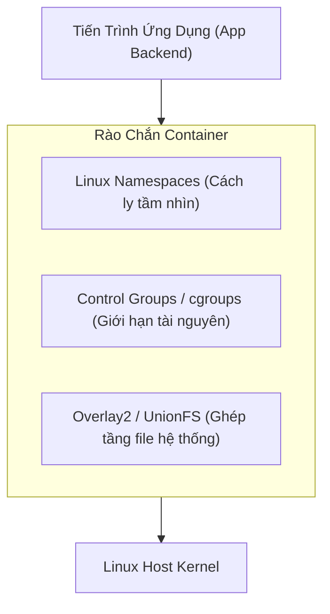

# 01 - Kiến Thức Cần Nắm: Container & Cơ Chế Hoạt Động

> Hiểu đúng bản chất của Container để không bao giờ đối xử với Container như một chiếc máy ảo (Virtual Machine).

---

## 1. Container Không Phải Là Máy Ảo

* **Máy ảo (Virtual Machine - VM):** Chạy trên một phần mềm Hypervisor (như VMware, KVM). Mỗi máy ảo có một nhân hệ điều hành (Guest Kernel) riêng biệt, tiêu tốn gigabyte dung lượng RAM và mất hàng phút để khởi động.
* **Container:** Chỉ là **một tiến trình (Process) thông thường** chạy trực tiếp trên Kernel của máy chủ Host, nhưng được bao bọc bởi 3 công nghệ cốt lõi của Linux Kernel:

---

## 2. Ba Trụ Cột Kỹ Thuật Tạo Nên Container

### 2.1 Linux Namespaces (Cách Ly Không Gian Tên)
Namespaces quy định: **Tiến trình trong container được phép nhìn thấy những gì?**
* **PID Namespace:** Tiến trình trong container nhìn thấy mình là PID 1, nhưng ở máy chủ Host nó có thể là PID 34521.
* **NET Namespace:** Cung cấp card mạng ảo (`veth`), bảng định tuyến (routing table) và dải IP riêng biệt.
* **MNT (Mount) Namespace:** Tạo cây thư mục gốc (`/`) hoàn toàn độc lập với filesystem của máy host.
* **IPC Namespace:** Ngăn tiến trình trong container truy cập bộ nhớ dùng chung (Shared Memory) của các tiến trình bên ngoài.
* **UTS Namespace:** Cho phép đặt hostname độc lập.
* **USER Namespace:** Cho phép ánh xạ UID trong container (ví dụ `root` UID 0) thành một user không có quyền trên host (ví dụ UID 10001).

### 2.2 Control Groups (cgroups v2)
cgroups quy định: **Tiến trình trong container được phép sử dụng bao nhiêu tài nguyên?**
* **CPU Quota:** Đảm bảo container không ăn quá 100% của một core CPU.
* **Memory Limit:** Thiết lập trần RAM cứng. Khi container sử dụng vượt mức này, cgroup sẽ kích hoạt OOM Killer tiêu diệt tiến trình bên trong container mà không làm ảnh hưởng đến máy chủ Host.
* **Block I/O:** Giới hạn tốc độ đọc/ghi đĩa (IOPS).

### 2.3 Overlay2 (Union File System)
* Docker Image được cấu thành từ nhiều lớp (Layers) chỉ đọc (**Read-Only**).
* Khi container khởi chạy, Docker phủ lên trên cùng một lớp đọc-ghi mỏng (**Read-Write Container Layer**).
* Mọi thao tác tạo mới hoặc sửa file chỉ diễn ra trên lớp Read-Write này bằng cơ chế **Copy-on-Write (CoW)**. Bản thân các layer của image gốc không bao giờ bị biến đổi.

---

## 3. Tư Duy Tạo Artifact Bất Biến (Immutable Artifact)

Một lỗi rất nặng của Backend khi mới tiếp cận DevOps là cố gắng SSH vào container để sửa file cấu hình hoặc cập nhật code:
* **Nguyên tắc vàng:** Container là tài sản tiêu hao (**Disposable / Ephemeral**). Container có thể chết đi và được thay thế bằng container mới bất cứ lúc nào.
* Toàn bộ binary, thư viện phụ thuộc phải được đóng băng bên trong Docker Image khi build.
* Cấu hình khác biệt giữa các môi trường (Dev, Staging, Prod) **chỉ được phép truyền vào thông qua Biến Môi Trường (Environment Variables)** theo nguyên tắc của The Twelve-Factor App.
