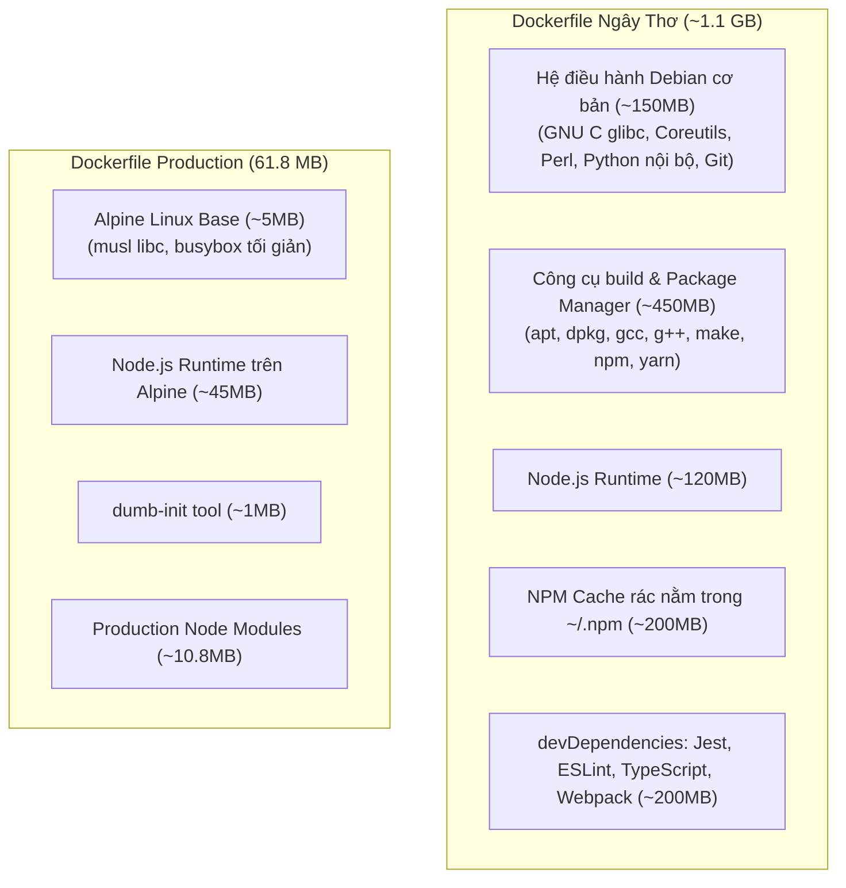

# Bóc Tách Kỹ Thuật: Tại Sao Image Giảm Từ 1.1GB Xuống 61.8MB?

> Bản phân tích chi tiết giải phẫu các tầng (Layers) của Docker Image, giải thích nguyên nhân sâu xa ở cấp độ hệ điều hành vì sao việc tối ưu giúp giảm hơn 94% dung lượng và tăng tốc độ CI/CD gấp 10 lần.

---

## 1. Bảng So Sánh Đối Đầu (1.1GB vs 61.8MB)

| Tiêu chí | Dockerfile Ngây Thơ (`Dockerfile.naive`) | Dockerfile Chuẩn Production (`Dockerfile.production`) |
| :--- | :--- | :--- |
| **Base Image** | `node:22` (dựa trên Debian Bookworm đầy đủ) | `node:22-alpine` (dựa trên Alpine Linux siêu nhẹ) |
| **Kỹ thuật Build** | Single-Stage (gộp chung build và chạy) | **Multi-Stage Build** (Stage 1 build, Stage 2 chắt lọc) |
| **Thư viện cài đặt** | Cả `dependencies` + `devDependencies` | **Chỉ cài production dependencies** (`--only=production`) |
| **Cache & File rác** | Giữ lại toàn bộ `~/.npm`, cache, compiler | **Bỏ sạch**, chỉ copy đúng thư mục `node_modules` sạch |
| **User thực thi** | `root` (UID 0 - Rất nguy hiểm) | `appuser` (UID 1001 - Non-Root an toàn) |
| **Dung lượng thực tế**| **~1.100 MB (1.1 GB)** | **61.8 MB (Giảm 94.4%)** |
| **Thời gian Pull Image**| Mất ~30 - 60 giây | **Mất ~1 - 2 giây** |

---

## 2. Giải Phẫu Chi Tiết: Dung Lượng 1.1GB Đến Từ Đâu?

Khi bạn gõ `FROM node:22`, Docker tải về một bản phân phối **Debian GNU/Linux đầy đủ**:

---

## 3. Bốn Nguyên Nhân Cốt Lõi Giúp Ép Dung Lượng Xuống 61.8MB

### Nguyên Nhân 1: Thay Thế Debian (glibc) Bằng Alpine Linux (musl libc)
* **Debian (`node:22`):** Đi kèm bộ thư viện GNU C (`glibc`), hàng ngàn tiện ích dòng lệnh, package manager `apt`, các file tài liệu hướng dẫn `man pages`, bộ gõ ngôn ngữ `locales`... Dung lượng nền đã ngốn gần **900MB**.
* **Alpine Linux (`node:22-alpine`):** Được thiết kế riêng cho container, sử dụng bộ thư viện C siêu tối giản **`musl libc`** và bộ công cụ **`busybox`** (gộp 300 lệnh Unix vào duy nhất 1 file thực thi 1MB). Hệ điều hành nền chỉ nặng đúng **5MB**.

### Nguyên Nhân 2: Phép Màu Của Kỹ Thuật "Multi-Stage Build"
Trong Docker, **mỗi câu lệnh `RUN` đều sinh ra một Layer chỉ đọc vĩnh viễn**:
* Nếu bạn chạy `RUN npm install` ở Dockerfile thông thường, `npm` sẽ tự động tạo thư mục cache `~/.npm` chứa hàng trăm file `.tar.gz` nén các package tải về.
* Dù bạn có gõ thêm `RUN rm -rf ~/.npm` ở dòng sau, theo cơ chế **Copy-on-Write** của Union File System, dữ liệu rác đó **vẫn nằm nguyên vẹn ở layer trước**, dung lượng image không hề giảm đi 1 byte nào!
* **Multi-Stage Build giải quyết triệt để:**
  * **Stage 1 (Builder):** Bạn tải npm, build code, sinh ra rác thoải mái.
  * **Stage 2 (Runner):** Bạn tạo một image trắng tinh mới toanh, rồi dùng lệnh `COPY --from=dependencies /app/node_modules ./node_modules`. Chỉ có những file thành phẩm thật sự cần thiết mới được mang sang Stage 2. Toàn bộ cache, công cụ build ở Stage 1 bị **vứt vào sọt rác 100%**.

### Nguyên Nhân 3: Loại Bỏ `devDependencies` Bằng Cờ `--only=production`
Trong các dự án thực tế, các thư viện phục vụ phát triển (Test framework như `Jest`/`Mocha`, Linting như `ESLint`/`Prettier`, Compiler như `TypeScript`/`Webpack`/`Babel`) thường chiếm tới **60% - 80%** kích thước của thư mục `node_modules`.
* Khi chạy ở môi trường Production, ứng dụng của bạn **không cần test lại** (vì CI pipeline đã test rồi) và **không cần compile lại**.
* Câu lệnh `npm install --only=production` (hoặc `npm ci --omit=dev`) cắt bỏ hoàn toàn hàng chục ngàn file rác này.

### Nguyên Nhân 4: Tấm Khiên `.dockerignore`
Nếu không có file `.dockerignore`, câu lệnh `COPY . .` sẽ vô tình copy luôn:
* Thư mục `.git` (Lịch sử commit của các dự án lớn thường nặng từ **100MB đến 1GB**).
* Thư mục `node_modules` cũ trên máy dev cá nhân (vừa nặng vừa có thể chứa các thư viện C build trên macOS không tương thích với Linux trong container).
* File `.env` chứa mật khẩu bí mật.

---

## 4. So Sánh Mở Rộng Ở Các Ngôn Ngữ Khác

Kỹ thuật này áp dụng đồng nhất cho mọi ngôn ngữ lập trình Backend:

| Ngôn ngữ | Single-Stage (Ngây thơ) | Multi-Stage Production | Công nghệ tối ưu sử dụng |
| :--- | :--- | :--- | :--- |
| **Golang** | `golang:1.24` (**~850 MB**) | **~18 MB (Giảm 98%)** | Build static binary với `-ldflags="-s -w"`, runtime dùng **Google Distroless / Scratch** (0MB OS). |
| **Java / Spring** | `openjdk:17` (**~650 MB**) | **~140 MB (Giảm 78%)** | Maven/Gradle build ở Stage 1, Stage 2 dùng **Eclipse Temurin JRE Alpine**. |
| **Python** | `python:3.12` (**~1.050 MB**) | **~95 MB (Giảm 91%)** | Dùng Virtualenv tách riêng wheel cache, runtime dùng **`python:3.12-slim`**. |
| **Node.js** | `node:22` (**~1.100 MB**) | **61.8 MB (Giảm 94.4%)**| Multi-stage tách node_modules, runtime dùng **Node Alpine + dumb-init**. |

---

## 5. Giá Trị Thực Tế Cho Doanh Nghiệp (Tại Sao CTO / Tech Lead Cực Thích?)

1. **Tốc độ Deploy & CI/CD tăng gấp 10 lần:**
   * Kéo (Pull) 1 image 60MB qua mạng chỉ mất **1-2 giây**. Kéo 1 image 1.1GB mất **30-60 giây**.
   * Khi deploy 20 server, tiết kiệm hàng chục phút chờ đợi.
2. **Kubernetes Auto-scaling (HPA) phản ứng tức thì:**
   * Khi có đợt traffic ùa vào, K8s cần bật thêm 10 Pod mới để gánh tải. Nếu image nhẹ 60MB, Pod kéo về và chạy ngay lập tức. Nếu image 1.1GB, Node mất cả phút để kéo image, server sẽ sập trước khi Pod kịp bật lên (**Cold Start failure**).
3. **Bảo mật vượt trội (Zero CVE Attack Surface):**
   * Trong image 1.1GB có sẵn `curl`, `wget`, `bash`, `python`, `git`, package manager. Hacker chỉ cần tìm được 1 lỗi nhỏ là có sẵn cả "kho vũ khí" trong container để tấn công tiếp.
   * Trong image tối ưu 60MB, hacker không có package manager để cài mã độc, không có curl để tải malware về máy chủ!
