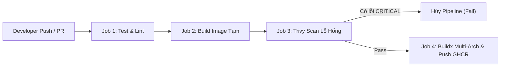

# 03 - Pipeline CI/CD Thực Chiến Với GitHub Actions

> Tự động hóa kiểm thử mã nguồn, quét lỗ hổng bảo mật của image (Trivy), và phát hành Docker image chuẩn đa kiến trúc (AMD64 & ARM64) lên GitHub Container Registry (GHCR).

---

## 1. Luồng Hoạt Động Của Pipeline (Workflow Architecture)



---

## 2. File Cấu Hình Hoàn Chỉnh (`.github/workflows/ci-cd.yml`)

```yaml
name: Production CI/CD Pipeline

on:
  push:
    branches: [ main ]
    tags: [ 'v*.*.*' ]
  pull_request:
    branches: [ main ]

permissions:
  contents: read
  packages: write
  security-events: write

env:
  REGISTRY: ghcr.io
  IMAGE_NAME: ${{ github.repository }}

jobs:
  # -----------------------------------------------------------
  # 1. JOB KIỂM THỬ MÃ NGUỒN
  # -----------------------------------------------------------
  test:
    name: Run Unit Tests & Lint
    runs-on: ubuntu-latest
    steps:
      - name: Checkout Code
        uses: actions/checkout@v4

      - name: Set up Go
        uses: actions/setup-go@v5
        with:
          go-version: '1.24'
          cache: true

      - name: Run Tests with Race Detector
        run: go test -v -race ./...

  # -----------------------------------------------------------
  # 2. JOB BUILD & QUÉT BẢO MẬT & PHÁT HÀNH IMAGE
  # -----------------------------------------------------------
  build-and-publish:
    name: Build, Scan & Publish Image
    needs: test
    runs-on: ubuntu-latest
    steps:
      - name: Checkout Code
        uses: actions/checkout@v4

      - name: Set up QEMU (Hỗ trợ build đa nền tảng AMD64/ARM64)
        uses: docker/setup-qemu-action@v3

      - name: Set up Docker Buildx
        uses: docker/setup-buildx-action@v3

      # Build một bản local image tạm thời để phục vụ quét lỗ hổng
      - name: Build Local Image for Security Scan
        uses: docker/build-push-action@v6
        with:
          context: .
          load: true
          tags: ${{ env.IMAGE_NAME }}:scan-temp
          cache-from: type=gha
          cache-to: type=gha,mode=max

      # Quét lỗ hổng CVE với Aqua Trivy
      - name: Run Trivy Vulnerability Scanner
        uses: aquasecurity/trivy-action@master
        with:
          image-ref: ${{ env.IMAGE_NAME }}:scan-temp
          format: 'table'
          severity: 'CRITICAL,HIGH'
          exit-code: '1' # Báo fail ngay lập tức nếu có lỗ hổng mức CRITICAL

      # Đăng nhập vào GHCR (chỉ chạy khi push vào main hoặc tạo tag, bỏ qua PR)
      - name: Log in to GitHub Container Registry
        if: github.event_name != 'pull_request'
        uses: docker/login-action@v3
        with:
          registry: ${{ env.REGISTRY }}
          username: ${{ github.actor }}
          password: ${{ secrets.GITHUB_TOKEN }}

      # Trích xuất metadata cho tag image (dạng Semantic Version & SHA)
      - name: Extract Docker Metadata
        id: meta
        uses: docker/metadata-action@v5
        with:
          images: ${{ env.REGISTRY }}/${{ env.IMAGE_NAME }}
          tags: |
            type=ref,event=branch
            type=semver,pattern={{version}}
            type=sha,format=short,prefix=sha-

      # Build chính thức đa kiến trúc và push lên registry
      - name: Build and Push Multi-Arch Image
        if: github.event_name != 'pull_request'
        uses: docker/build-push-action@v6
        with:
          context: .
          platforms: linux/amd64,linux/arm64
          push: true
          tags: ${{ steps.meta.outputs.tags }}
          labels: ${{ steps.meta.outputs.labels }}
          cache-from: type=gha
          cache-to: type=gha,mode=max
```
