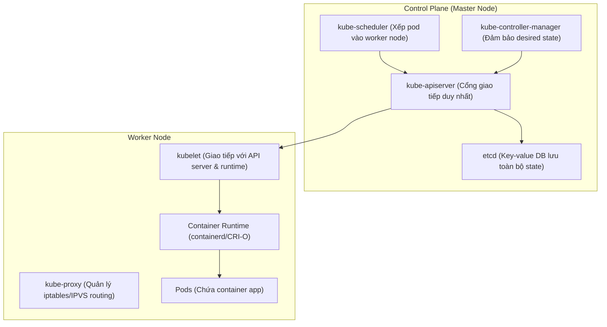

# Phase 3: Kubernetes Orchestration & GitOps

> **Mục tiêu:** Nắm vững Kubernetes (K8s) từ cấp độ kiến trúc điều phối đến triển khai thực tế bằng Helm và quản trị tự động hóa hoàn toàn bằng GitOps (ArgoCD).

---

## 1. Kiến Trúc Cốt Lõi Của Kubernetes



---

## 2. K8s Manifest Chuẩn Production (Zero-Downtime Deployment)

Đây là mẫu manifest chuẩn production cho một backend microservice, tích hợp đầy đủ Probes, Resource Management và Zero-Downtime Rolling Update:

```yaml
apiVersion: apps/v1
kind: Deployment
metadata:
  name: backend-api
  namespace: production
  labels:
    app.kubernetes.io/name: backend-api
    app.kubernetes.io/version: "1.0.0"
spec:
  replicas: 3
  # Đảm bảo Zero-Downtime: Luôn có 100% pod sống trong lúc rollout
  strategy:
    type: RollingUpdate
    rollingUpdate:
      maxSurge: 25%
      maxUnavailable: 0
  selector:
    matchLabels:
      app: backend-api
  template:
    metadata:
      labels:
        app: backend-api
    spec:
      # Chờ pod giải phóng kết nối trước khi bị hạ
      terminationGracePeriodSeconds: 30
      containers:
      - name: backend-api
        image: ghcr.io/yourorg/backend-api:sha-a1b2c3d
        imagePullPolicy: IfNotPresent
        ports:
        - name: http
          containerPort: 8080

        # CẤU HÌNH TÀI NGUYÊN BẮT BUỘC
        resources:
          requests:
            cpu: 200m
            memory: 256Mi
          limits:
            cpu: 1000m
            memory: 512Mi

        # BỘ 3 HEALTH PROBES CHUẨN XÁC
        # 1. Startup Probe: Dành riêng cho app khởi động chậm (load DB, cache)
        startupProbe:
          httpGet:
            path: /healthz/startup
            port: http
          failureThreshold: 30
          periodSeconds: 5

        # 2. Readiness Probe: Quyết định pod có được nhận traffic từ Service không
        readinessProbe:
          httpGet:
            path: /healthz/ready
            port: http
          initialDelaySeconds: 5
          periodSeconds: 5
          timeoutSeconds: 2
          failureThreshold: 2

        # 3. Liveness Probe: Quyết định pod có bị restart không khi deadlock
        livenessProbe:
          httpGet:
            path: /healthz/live
            port: http
          initialDelaySeconds: 10
          periodSeconds: 10
          timeoutSeconds: 3
          failureThreshold: 3

        envFrom:
        - configMapRef:
            name: backend-config
        - secretRef:
            name: backend-secrets
---
apiVersion: v1
kind: Service
metadata:
  name: backend-api-svc
  namespace: production
spec:
  type: ClusterIP
  selector:
    app: backend-api
  ports:
  - name: http
    port: 80
    targetPort: 8080
---
apiVersion: autoscaling/v2
kind: HorizontalPodAutoscaler
metadata:
  name: backend-api-hpa
  namespace: production
spec:
  scaleTargetRef:
    apiVersion: apps/v1
    kind: Deployment
    name: backend-api
  minReplicas: 3
  maxReplicas: 10
  metrics:
  - type: Resource
    resource:
      name: cpu
      target:
        type: Utilization
        averageUtilization: 75
```

---

## 3. Quản Lý Cấu Hình Với Helm 3

Thay vì viết hàng loạt YAML cứng, ta dùng **Helm** để tham số hóa (parameterize) manifest:

### 3.1 Cấu Trúc Helm Chart
```text
backend-chart/
├── Chart.yaml             # Metadata (name, version, appVersion)
├── values.yaml            # Cấu hình mặc định (default values)
├── values-staging.yaml    # Override cấu hình cho Staging
├── values-prod.yaml       # Override cấu hình cho Production
└── templates/
    ├── _helpers.tpl       # Các hàm template tái sử dụng
    ├── deployment.yaml
    ├── service.yaml
    ├── ingress.yaml
    └── hpa.yaml
```

### 3.2 Lệnh Thực Hành Cần Thuộc Lòng
```bash
# 1. Kiểm tra cú pháp template (Lint)
helm lint ./backend-chart

# 2. Render thử YAML ra màn hình để kiểm tra logic biến
helm template backend-release ./backend-chart -f ./backend-chart/values-prod.yaml

# 3. Cài đặt hoặc Nâng cấp (Dry-run trước khi apply)
helm upgrade --install backend-release ./backend-chart \
  -n production --create-namespace \
  -f ./backend-chart/values-prod.yaml \
  --dry-run
```

---

## 4. GitOps Hiện Đại Với ArgoCD

GitOps là phương pháp lấy **Git Repository làm Single Source of Truth** cho toàn bộ hạ tầng K8s. Không còn ai dùng lệnh `kubectl apply` từ máy cá nhân vào Production.

### 4.1 Mô Hình GitOps 2 Repositories
* **App Repo (Source Code):** Chứa code backend + Dockerfile + CI. Khi code merge -> CI build image mới (`sha-123`) và commit cập nhật tag image sang GitOps Repo.
* **GitOps Repo (K8s Manifests):** Chứa Helm chart hoặc Kustomize. **ArgoCD** giám sát repo này và tự động đồng bộ (sync) vào Cluster.

### 4.2 ArgoCD Application Manifest
File: `argocd/applications/backend-prod.yaml`

```yaml
apiVersion: argoproj.io/v1alpha1
kind: Application
metadata:
  name: backend-production
  namespace: argocd
  finalizers:
    - resources-finalizer.argocd.argoproj.io
spec:
  project: default
  source:
    repoURL: https://github.com/yourorg/gitops-infra.git
    targetRevision: main
    path: charts/backend-api
    helm:
      valueFiles:
        - values-prod.yaml
  destination:
    server: https://kubernetes.default.svc
    namespace: production
  syncPolicy:
    automated:
      prune: true       # Xóa tài nguyên trên K8s nếu file YAML bị xóa khỏi Git
      selfHeal: true    # Nếu ai đó sửa tay kubectl trên cluster, ArgoCD tự đè lại theo Git
    syncOptions:
      - CreateNamespace=true
```

---

## 5. Những Lỗ Hổng Tư Duy Cần Tránh

1. **Liveness Probe kiểm tra Database bên ngoài:**
   * **Sai lầm phổ biến:** Cho liveness probe ping tới Postgres/Redis. Khi Postgres quá tải hoặc bảo trì, liveness probe trả về fail -> K8s restart hàng loạt Pod cùng lúc -> Tạo thành **Thundering Herd Problem** đè bẹp hệ thống.
   * **Nguyên tắc:** Liveness Probe chỉ kiểm tra tiến trình app có bị deadlock không. Việc kiểm tra dependency thuộc về Readiness Probe.
2. **Không set `requests` và `limits`:**
   * Không set `requests`: Scheduler không biết xếp Pod vào node nào, dẫn đến dồn 10 pod nặng vào 1 node gây nghẽn.
   * Không set `limits.memory`: Pod rò rỉ RAM sẽ ăn sạch RAM của Node, khiến hệ thống kích hoạt OOM Killer bắn ngẫu nhiên các Pod khác trên Node.
3. **Set `CPU limit` quá thấp:**
   * CPU limit hoạt động dựa trên cơ chế quota của Linux CFS (Completely Fair Scheduler). Khi vượt limit, CPU bị throttle (bóp xung nhịp) khiến response time API tăng vọt từ 20ms lên 2000ms mà không báo lỗi.

---

## 6. Tiêu Chuẩn Hoàn Thành (Milestone 3 Checklist)

- [ ] Tạo được cụm local K8s bằng `k3d` (`k3d cluster create my-cluster --servers 1 --agents 2`).
- [ ] Phân biệt được nhiệm vụ và cấu hình chính xác 3 loại probe: `startupProbe`, `livenessProbe`, `readinessProbe`.
- [ ] Đóng gói thành công ứng dụng vào 1 Helm Chart hoàn chỉnh, hỗ trợ cấu hình đa môi trường qua values files.
- [ ] Cài đặt ArgoCD lên cụm local và cấu hình tự động sync ứng dụng mỗi khi GitOps repo có commit mới.
