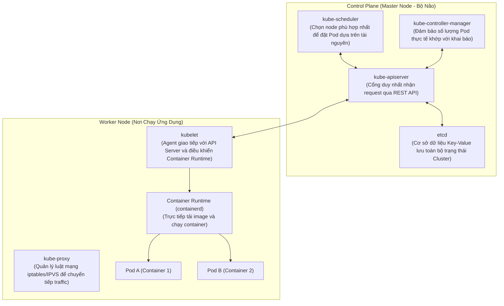

# 01 - Kiến Thức Cần Nắm: Kiến Trúc Kubernetes

> Hiểu cách Kubernetes (K8s) điều phối hàng trăm container, tự phục hồi khi có lỗi và định tuyến lưu lượng truy cập.

---

## 1. Kiến Trúc Tổng Thể: Control Plane & Worker Nodes

Kubernetes phân tách rõ ràng giữa **Khối điều khiển (Control Plane)** và **Khối thực thi (Worker Nodes)**:

---

## 2. Các Đối Tượng Cốt Lõi (Core K8s Objects) Cho Backend Dev

### 2.1 Pod: Đơn Vị Nhỏ Nhất Trong K8s
* K8s **không bao giờ chạy container đơn lẻ trực tiếp**, mà chạy một **Pod**.
* Một Pod có thể chứa 1 container chính (App Backend) và các container phụ (**Sidecar Container**, ví dụ: proxy, log shipper).
* Tất cả các container trong cùng một Pod **chia sẻ chung Network Namespace (chung IP, giao tiếp qua `localhost`)** và có thể chia sẻ chung Volume lưu trữ.
* Pod mang tính chất tạm thời (**Ephemeral**): Khi Pod chết, IP của nó mất đi và Pod mới sinh ra sẽ có một IP hoàn toàn khác.

### 2.2 Deployment & ReplicaSet: Quản Lý Vòng Đời & Scale
* Bạn không bao giờ tự tạo Pod riêng lẻ trong production. Bạn tạo một **Deployment**.
* Deployment quản lý **ReplicaSet**, ReplicaSet chịu trách nhiệm đảm bảo số lượng Pod mong muốn (Desired State, ví dụ `replicas: 3`) luôn luôn hoạt động.
* Deployment hỗ trợ chiến lược cập nhật không gián đoạn dịch vụ (**RollingUpdate**).

### 2.3 Service: Địa Chỉ IP Ảo Ổn Định & Load Balancing
Vì Pod có thể sinh ra và chết đi liên tục với IP thay đổi, **Service** cung cấp một địa chỉ IP ảo cố định (**ClusterIP**) và một tên miền nội bộ (ví dụ: `backend-svc.production.svc.cluster.local`):
* Service sử dụng cơ chế **Label Selector** để tự động gom nhóm các Pod có cùng nhãn (`app: backend`).
* Service đóng vai trò làm bộ cân bằng tải nội bộ (Layer 4 TCP/UDP Load Balancer).
* **Các loại Service:**
  * `ClusterIP` (Mặc định): Chỉ truy cập được từ bên trong Cluster.
  * `NodePort`: Mở một cổng tĩnh (30000-32767) trên từng Worker Node.
  * `LoadBalancer`: Tự động gọi API của Cloud Provider (AWS/GCP) để tạo Network Load Balancer thật trỏ vào Cluster.

### 2.4 Ingress Controller: Cổng Vào HTTP/HTTPS (Layer 7)
* Đứng ở cửa ngõ Cluster để tiếp nhận traffic từ Internet, xử lý định tuyến theo Domain/Path (`api.domain.com/v1 -> service-a`, `api.domain.com/v2 -> service-b`) và xử lý SSL/TLS termination.
* Các Ingress Controller phổ biến: **Nginx Ingress Controller**, **Traefik**, hoặc chuẩn mới **Gateway API**.
