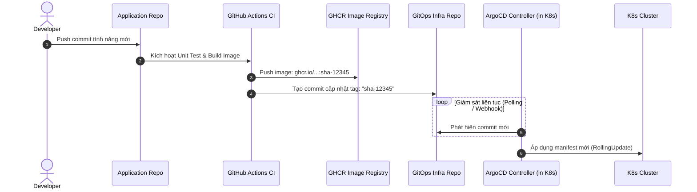

# 04 - GitOps Hiện Đại Với ArgoCD

> Loại bỏ hoàn toàn việc gõ `kubectl apply` từ máy cá nhân lên cụm Production. Toàn bộ trạng thái của hệ thống được quản trị tự động thông qua Git.

---

## 1. Triết Lý Cốt Lõi Của GitOps

GitOps dựa trên 4 nguyên tắc nền tảng:
1. **Khai Báo Toàn Bộ (Declarative):** Mọi tài nguyên K8s được mô tả dưới dạng code (YAML/Helm).
2. **Phiên Bản Hóa Trên Git (Versioned & Immutable):** Git là nơi lưu trữ trạng thái duy nhất (*Single Source of Truth*). Muốn đổi gì trên hệ thống thì phải commit lên Git.
3. **Kéo Tự Động (Pushed by Git -> Pulled by Agent):** Thay vì CI đẩy code vào K8s, một agent chạy trong K8s (**ArgoCD**) chủ động kéo cấu hình từ Git về.
4. **Tự Động Hòa Giải Sai Lệch (Self-Healing & Drift Reconciliation):** Nếu ai đó tự ý gõ lệnh sửa Pod trực tiếp trên K8s, ArgoCD phát hiện sai lệch so với Git và ngay lập tức đè trạng thái trên K8s trở về đúng theo Git.

---

## 2. Mô Hình 2 Repositories (App Repo vs GitOps Repo)



---

## 3. Cấu Hình Khai Báo ArgoCD Application (`application.yaml`)

```yaml
apiVersion: argoproj.io/v1alpha1
kind: Application
metadata:
  name: backend-production
  namespace: argocd
  finalizers:
    # Đảm bảo xóa sạch tài nguyên K8s nếu Application này bị xóa
    - resources-finalizer.argocd.argoproj.io
spec:
  project: default

  # 1. NGUỒN CẤU HÌNH (SOURCE)
  source:
    repoURL: https://github.com/yourorg/gitops-deployments.git
    targetRevision: main
    path: environments/production/backend-api
    helm:
      valueFiles:
        - values.yaml

  # 2. ĐÍCH ĐẾN TRIỂN KHAI (DESTINATION)
  destination:
    server: https://kubernetes.default.svc
    namespace: production

  # 3. CHÍNH SÁCH ĐỒNG BỘ (SYNC POLICY)
  syncPolicy:
    automated:
      prune: true     # XÓA tài nguyên trên K8s nếu file YAML bị xóa trên Git
      selfHeal: true  # TỰ SỬA LỖI: nếu cluster bị thay đổi tay, đè lại theo Git
    syncOptions:
      - CreateNamespace=true
      - PruneLast=true
    retry:
      limit: 5
      backoff:
        duration: 5s
        factor: 2
        maxDuration: 3m
```
