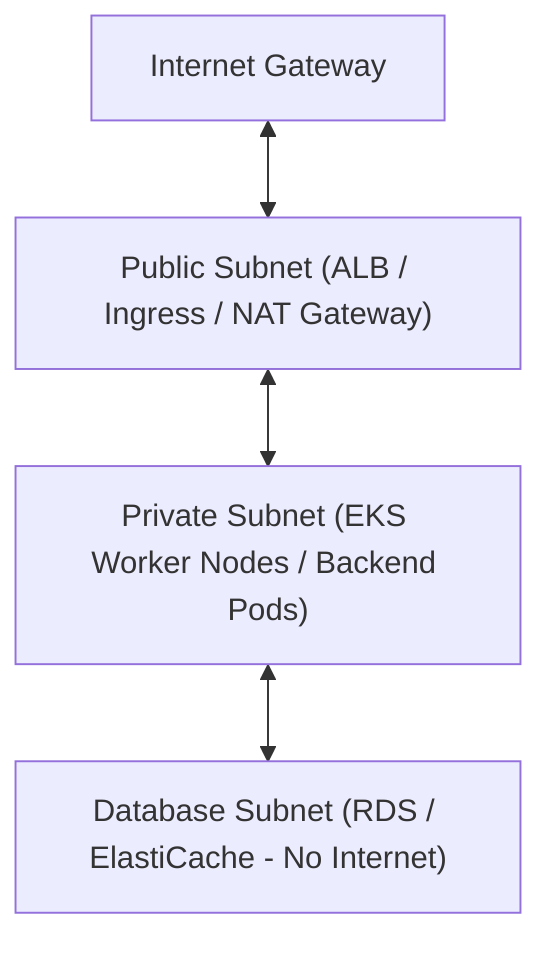

# Phase 4: Infrastructure as Code (IaC) & Cloud Architecture

> **Mục tiêu:** Làm chủ tư duy xây dựng hạ tầng Cloud chuẩn bảo mật nhiều lớp và tự động hóa toàn bộ việc cấp phát tài nguyên bằng Terraform (HCL).

---

## 1. Kiến Trúc Mạng Cloud Chuẩn Production (AWS VPC Multi-AZ)

Một kiến trúc chuẩn luôn chia làm 3 tầng Subnet trải đều trên ít nhất 2 Availability Zones (AZ) để chống thảm họa (High Availability):



* **Public Subnet:** Chứa Application Load Balancer (ALB) và NAT Gateway. Cho phép nhận traffic từ Internet.
* **Private Subnet:** Chứa cụm máy chủ Backend/EKS. Ra ngoài Internet gián tiếp qua NAT Gateway (để tải package, gọi external API), nhưng bên ngoài không thể kết nối trực tiếp vào.
* **Database Subnet (Isolated):** Chứa RDS/PostgreSQL, Redis. Không có route ra Internet (kể cả qua NAT), chỉ chấp nhận kết nối từ Private Subnet qua Security Group.

---

## 2. Terraform Chuẩn Dự Án Thực Tế

### 2.1 Cấu Trúc Thư Mục Chuẩn Production
```text
terraform-infra/
├── modules/                   # Các module tái sử dụng
│   ├── vpc/
│   │   ├── main.tf
│   │   ├── variables.tf
│   │   └── outputs.tf
│   └── rds/
└── environments/              # Môi trường độc lập
    ├── staging/
    │   ├── backend.tf         # Lưu state riêng biệt
    │   ├── main.tf
    │   └── terraform.tfvars
    └── production/
        ├── backend.tf
        ├── main.tf
        └── terraform.tfvars
```

### 2.2 Remote State & Lock (Bắt Buộc Khi Làm Team)
File: `environments/production/backend.tf`

```hcl
terraform {
  required_version = ">= 1.5.0"
  required_providers {
    aws = {
      source  = "hashicorp/aws"
      version = "~> 5.0"
    }
  }

  backend "s3" {
    bucket         = "myorg-terraform-state-prod"
    key            = "services/backend/terraform.tfstate"
    region         = "ap-southeast-1"
    dynamodb_table = "terraform-locks" # Cơ chế khóa tránh 2 người cùng apply một lúc
    encrypt        = true
  }
}

provider "aws" {
  region = var.aws_region

  default_tags {
    tags = {
      Environment = var.environment
      ManagedBy   = "Terraform"
      Owner       = "PlatformTeam"
    }
  }
}
```

### 2.3 Khởi Tạo Module VPC & Security Groups
File: `modules/vpc/main.tf`

```hcl
resource "aws_vpc" "main" {
  cidr_block           = var.vpc_cidr
  enable_dns_hostnames = true
  enable_dns_support   = true

  tags = {
    Name = "${var.environment}-vpc"
  }
}

# Private Subnet cho Backend Workloads
resource "aws_subnet" "private" {
  count             = length(var.private_subnet_cidrs)
  vpc_id            = aws_vpc.main.id
  cidr_block        = var.private_subnet_cidrs[count.index]
  availability_zone = var.availability_zones[count.index]

  tags = {
    Name                              = "${var.environment}-private-${var.availability_zones[count.index]}"
    "kubernetes.io/role/internal-elb" = "1" # Tag để K8s tự động bind Internal Load Balancer
  }
}

# Security Group chỉ cho phép Backend truy cập Database
resource "aws_security_group" "db_sg" {
  name        = "${var.environment}-db-sg"
  description = "Chi chap nhan traffic tu Private App Subnet"
  vpc_id      = aws_vpc.main.id

  ingress {
    description     = "PostgreSQL tu App"
    from_port       = 5432
    to_port         = 5432
    protocol        = "tcp"
    security_groups = [var.app_security_group_id] # Chỉ định SG của Backend Pods
  }

  egress {
    from_port   = 0
    to_port     = 0
    protocol    = "-1"
    cidr_blocks = ["0.0.0.0/0"]
  }
}
```

---

## 3. IAM Bảo Mật Cấp Cao: IRSA (IAM Roles for Service Accounts)

Tuyệt đối **không** tạo user IAM rồi sinh file Access Key/Secret Key (`AKIA...`) nhét vào biến môi trường của container. Thay vào đó, dùng **IRSA**:

1. Tạo một IAM Role trên AWS có quyền truy cập S3 bucket.
2. Thiết lập Trust Relationship cho phép K8s OpenID Connect (OIDC) Provider của cụm EKS giả lập role này.
3. Gán Role vào K8s `ServiceAccount`:
   ```yaml
   apiVersion: v1
   kind: ServiceAccount
   metadata:
     name: backend-service-account
     annotations:
       eks.amazonaws.com/role-arn: arn:aws:iam::123456789012:role/BackendS3AccessRole
   ```
4. Pod của bạn tự động có AWS credential ngắn hạn (tự xoay vòng token mỗi 1 giờ) thông qua AWS SDK trong code mà không cần lưu password nào.

---

## 4. Các Sai Lầm Bảo Mật Nghiêm Trọng

1. **Commit `terraform.tfstate` lên Git:**
   * File state chứa plain-text của mọi mật khẩu, database passwords, private keys. Một khi push lên Git là lộ toàn bộ thông tin nhạy cảm.
2. **Mở Database ra Public (`0.0.0.0/0`):**
   * Cho phép RDS có Public IP để "tiện dùng DBeaver ở nhà connect vào". Đây là nguyên nhân hàng đầu khiến database bị bot scan và mã hóa ransomware đòi tiền chuộc. Muốn connect hãy dùng **VPN (WireGuard)** hoặc **AWS SSM Session Manager Bastion Host**.
3. **Dùng lệnh `terraform apply` không qua code review:**
   * Thay đổi hạ tầng phải được review qua PR tương tự như code tính năng. Áp dụng công cụ **Atlantis** hoặc Terraform Cloud/GitHub Actions để xem trước kế hoạch `terraform plan` trên PR trước khi merge.

---

## 5. Tiêu Chuẩn Hoàn Thành (Milestone 4 Checklist)

- [ ] Hiểu và giải thích được luồng traffic giữa Public Subnet, Private Subnet và NAT Gateway.
- [ ] Viết được mã Terraform tạo VPC, Subnets, Route Tables phân bổ trên 2 Availability Zones.
- [ ] Cấu hình thành công Remote State trên S3 và cơ chế Lock với DynamoDB.
- [ ] Triển khai được cơ chế IAM Role gán quyền cho K8s Service Account (IRSA), nói không với static keys.
