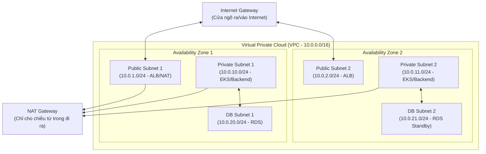

# 01 - Kiến Thức Cần Nắm: Mạng Cloud & IAM

> Nền tảng thiết kế hạ tầng Cloud chuẩn bảo mật nhiều lớp (Defense in Depth) và kiểm soát truy cập không dùng mật khẩu tĩnh.

---

## 1. Kiến Trúc Mạng Cloud: VPC, Subnetting & Định Tuyến (Routing)

Virtual Private Cloud (VPC) là một mạng riêng ảo biệt lập trên hạ tầng đám mây (AWS/GCP). Một kiến trúc sản xuất luôn phân tầng thành 3 loại Subnet trên tối thiểu 2 Availability Zones (AZ):

### So Sánh 3 Tầng Subnet

| Loại Subnet | Tuyến đường mặc định (0.0.0.0/0) | Được gán Public IP? | Chứa tài nguyên nào? |
| :--- | :--- | :--- | :--- |
| **Public Subnet** | Trỏ thẳng tới **Internet Gateway (IGW)** | Có | Application Load Balancer (ALB), NAT Gateway, Bastion Host. |
| **Private Subnet** | Trỏ tới **NAT Gateway** (nằm ở Public Subnet) | Không | EKS Worker Nodes, Backend Services, Background Workers. |
| **Database Subnet** | **Không có route ra ngoài** (Local VPC only) | Không | RDS PostgreSQL/MySQL, Redis Cache, DocumentDB. |

---

## 2. Quản Trị Danh Tính & Phân Quyền (IAM)

### 2.1 Các Khái Niệm IAM Cốt Lõi
* **IAM User:** Dành riêng cho người thật đăng nhập (bắt buộc bật xác thực 2 lớp MFA). **Không dùng IAM User cho ứng dụng.**
* **IAM Role:** Một danh tính không có mật khẩu hay secret key cố định, có thể được "đảm nhiệm" (**Assume**) bởi một tài nguyên khác (như máy ảo EC2 hoặc K8s Pod).
* **IAM Policy:** Văn bản JSON quy định quyền hạn chi tiết (nguyên tắc đặc quyền tối thiểu - *Principle of Least Privilege*).

### 2.2 Đỉnh Cao Bảo Mật K8s: IRSA (IAM Roles for Service Accounts)
* **Vấn đề cũ:** Backend muốn upload file lên AWS S3. Developer tạo một IAM User, sinh Access Key / Secret Key rồi dán vào file `.env` hoặc ConfigMap. Khi key này bị lộ, toàn bộ tài khoản AWS bị hacker kiểm soát để đào tiền ảo.
* **Chuẩn hiện đại IRSA:**
  1. Cụm EKS tích hợp với AWS IAM thông qua chuẩn OpenID Connect (OIDC).
  2. Tạo IAM Role cấp quyền ghi S3, nhưng thiết lập Trust Relationship: **Chỉ chấp nhận token được ký bởi ServiceAccount của Kubernetes**.
  3. K8s tự động inject một token ngắn hạn vào Pod. AWS SDK trong code backend sẽ tự đọc token này và đổi lấy credential tạm thời (tự hết hạn sau 60 phút).
  4. **Kết quả:** 100% không còn mật khẩu cứng nào trong code hay container.
