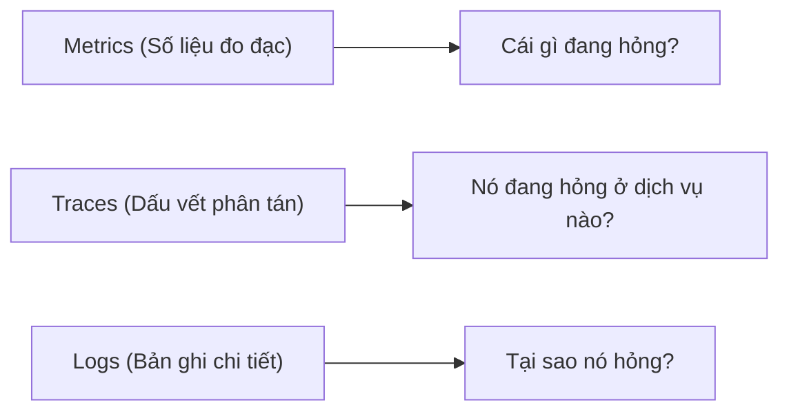

# Phase 5: Observability & SRE Practice

> **Mục tiêu:** Xây dựng hệ thống giám sát toàn diện (Metrics, Logs, Traces) và áp dụng tư duy SRE (Site Reliability Engineering) để chủ động kiểm soát chất lượng vận hành.

---

## 1. Ba Trụ Cột Của Observability & 4 Golden Signals



### 4 Golden Signals (Theo Google SRE Book)
1. **Latency (Độ trễ):** Thời gian phản hồi request (ưu tiên đo P95/P99 percentile thay vì đo trung bình Average).
2. **Traffic (Lưu lượng):** Số lượng request/giây (RPS) hoặc transaction/giây (TPS).
3. **Errors (Tỷ lệ lỗi):** Tỷ lệ request thất bại (HTTP 5xx hoặc explicit error codes).
4. **Saturation (Độ bão hòa):** Mức độ quá tải tài nguyên (CPU %, RAM %, DB Connection Pool utilization %).

---

## 2. Metrics & PromQL Thực Chiến Với Prometheus

### 2.1 Bốn Loại Metric Cốt Lõi
* **Counter:** Chỉ tăng (hoặc reset về 0 khi app restart). Dùng cho: số lượng request, số exception.
* **Gauge:** Giá trị có thể tăng hoặc giảm tức thời. Dùng cho: số active connections, dung lượng memory, số worker threads rảnh.
* **Histogram:** Đo lường phân phối dữ liệu theo các mốc (buckets). Dùng cho: thời gian xử lý request (latency), kích thước payload.
* **Summary:** Tương tự Histogram nhưng tính toán quantile trực tiếp tại client.

### 2.2 Các Câu Lệnh PromQL Cần Phải Thuộc Lòng

```promql
# 1. Tính số request/giây (RPS) của service trong 5 phút gần nhất
sum(rate(http_requests_total{app="backend-api"}[5m]))

# 2. Tính tỷ lệ % lỗi 5xx trên tổng lượng request
(
  sum(rate(http_requests_total{app="backend-api", status=~"5.."}[5m]))
  /
  sum(rate(http_requests_total{app="backend-api"}[5m]))
) * 100

# 3. Tính độ trễ P99 (99% request nhanh hơn mốc này)
histogram_quantile(0.99, sum(rate(http_request_duration_seconds_bucket{app="backend-api"}[5m])) by (le))

# 4. Kiểm tra tỷ lệ sử dụng Connection Pool của Database
(pg_stat_activity_count / pg_settings_max_connections) * 100
```

---

## 3. Cấu Hình Cảnh Báo Chuẩn (PrometheusRule)

Tránh spam thông báo gây "Alert Fatigue" (chai lì cảnh báo). Chỉ alert khi ảnh hưởng trực tiếp đến người dùng:

File: `monitoring/alerts/backend-rules.yaml`

```yaml
apiVersion: monitoring.coreos.com/v1
kind: PrometheusRule
metadata:
  name: backend-api-alerts
  namespace: monitoring
spec:
  groups:
  - name: backend.rules
    rules:
    # Cảnh báo khi tỷ lệ lỗi vượt ngưỡng 2% kéo dài trong 3 phút
    - alert: HighHttpErrorRate
      expr: |
        (
          sum(rate(http_requests_total{status=~"5.."}[5m]))
          /
          sum(rate(http_requests_total[5m]))
        ) * 100 > 2
      for: 3m
      labels:
        severity: critical
      annotations:
        summary: "Tỷ lệ lỗi HTTP 5xx cao bất thường trên {{ $labels.instance }}"
        description: "Tỷ lệ lỗi hiện tại đạt {{ $value | printf \"%.2f\" }}% (> 2%) trong 3 phút qua."
        runbook_url: "https://wiki.internal/runbooks/high-error-rate"

    # Cảnh báo khi Pod bị restart liên tục (CrashLoopBackOff)
    - alert: PodFrequentRestarts
      expr: sum by (pod) (increase(kube_pod_container_status_restarts_total[15m])) > 3
      for: 1m
      labels:
        severity: warning
      annotations:
        summary: "Pod {{ $labels.pod }} restart liên tục"
        description: "Pod đã restart hơn 3 lần trong 15 phút qua. Khả năng cao do OOMKilled hoặc panic lúc khởi động."
```

---

## 4. Centralized Logging & Distributed Tracing

### 4.1 Thu Thập Log Với Grafana Loki
* Thay vì cài ElasticSearch nặng nề (ngốn nhiều RAM), kiến trúc hiện đại chuộng **Grafana Loki** (chỉ đánh index metadata labels, log content được nén và lưu S3 rẻ gấp 10 lần).
* Truy vấn log theo cú pháp LogQL:
  ```logql
  {app="backend-api", namespace="production"} |= "ERROR" | json | latency > 2000
  ```

### 4.2 Distributed Tracing Với OpenTelemetry (OTel)
Trong kiến trúc Microservices, request của người dùng đi qua API Gateway -> Auth Service -> Order Service -> Payment Service. Khi request bị chậm 5 giây, ta không thể mò từng dòng log của 4 service để tìm nguyên nhân.
* **OpenTelemetry** truyền tải header chuẩn `traceparent` (chứa `TraceId` và `SpanId`) xuyên suốt các giao tiếp HTTP/gRPC.
* Bất kỳ service nào nhận request sẽ ghi nhận thời gian bắt đầu và kết thúc của từng hàm/SQL query vào cùng một `TraceId`.
* Xem kết quả trực quan dạng Gantt Chart trên **Grafana Tempo** hoặc **Jaeger** để phát hiện chính xác câu lệnh SQL hay API nào đang làm nghẽn.

---

## 5. Các Sai Lầm Cực Kỳ Phổ Biến

1. **Thảm họa High Cardinality trong Prometheus:**
   * **Sai lầm:** Gắn `user_id`, `order_id`, hoặc `email` làm label của metric:
     `http_requests_total{user_id="12345"}`
   * **Hậu quả:** Prometheus sinh ra hàng triệu time-series khác nhau trong RAM -> Sập Prometheus server ngay lập tức (OOM). Label chỉ được chứa các giá trị có tập hợp hữu hạn (status code, method, route).
2. **Log cả dữ liệu nhạy cảm (PII / Credentials):**
   * Log header Authorization, password, token, số thẻ ngân hàng. Vừa vi phạm tiêu chuẩn bảo mật (PCI-DSS, GDPR) vừa tạo rủi ro rò rỉ dữ liệu khi log được đưa về dashboard chung.
3. **Đo lường trung bình (Average) thay vì Percentiles (P95/P99):**
   * Nếu 95 request mất 10ms, nhưng 5 request mất 10 giây:
     * Thời gian trung bình: `~500ms` (nhìn có vẻ ổn).
     * Thời gian P99: `10 giây` (5% người dùng đang trải nghiệm cực kỳ tệ hại).
   * **Luôn giám sát bằng P95 và P99.**

---

## 6. Tiêu Chuẩn Hoàn Thành (Milestone 5 Checklist)

- [ ] Tích hợp Prometheus client vào backend code và expose endpoint `/metrics` chuẩn.
- [ ] Dựng Grafana Dashboard hiển thị đầy đủ 4 Golden Signals (RPS, Latency P99, 5xx Error Rate, Memory/CPU).
- [ ] Viết được Alertmanager Rule gửi thông báo về Telegram hoặc Slack khi tỷ lệ lỗi vượt ngưỡng.
- [ ] Hiểu cơ chế phân tán `TraceId` của OpenTelemetry để trace request qua nhiều service.
