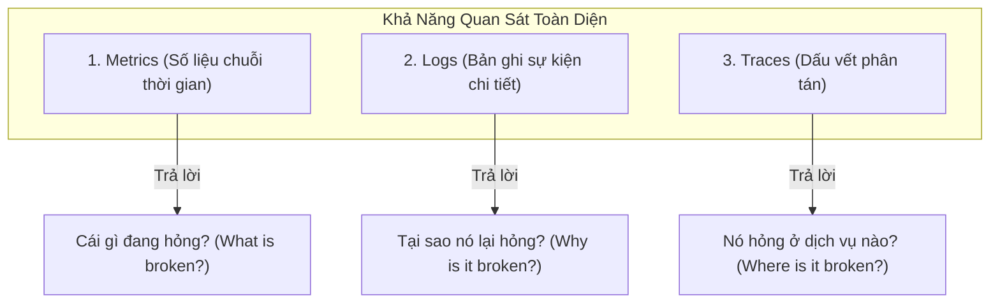

# 01 - Kiến Thức Cần Nắm: Ba Trụ Cột Observability & Tư Duy SRE

> Giám sát truyền thống (Monitoring) chỉ cho bạn biết hệ thống đã sập. Khả năng quan sát (Observability) cho phép bạn suy luận được nguyên nhân gốc rễ bên trong dựa trên các dữ liệu đo lường đầu ra.

---

## 1. Ba Trụ Cột Của Observability (The 3 Pillars)

1. **Metrics:** Dữ liệu dạng số được tổng hợp theo thời gian (ví dụ: CPU 80%, 200 req/s). Rất nhẹ, lưu trữ được nhiều tháng/năm, dùng để phát hiện bất thường và kích hoạt cảnh báo.
2. **Logs:** Bản ghi text/JSON ghi lại từng sự kiện cụ thể kèm theo ngữ cảnh (ví dụ: `NullPointerException at line 45`). Dữ liệu rất lớn, tốn tài nguyên lưu trữ, dùng để bóc tách nguyên nhân sau khi có cảnh báo.
3. **Traces:** Theo dõi hành trình của một request khi nó di chuyển xuyên qua hàng chục microservices khác nhau trong toàn bộ hệ thống.

---

## 2. Bốn Tín Hiệu Vàng (The 4 Golden Signals)

Theo cuốn sách kinh điển *Site Reliability Engineering* của Google, mọi dịch vụ backend đều cần tập trung theo dõi 4 chỉ số cốt lõi:

* **Latency (Độ trễ):** Thời gian cần thiết để xử lý một request. Cần phân tách rõ độ trễ của các request thành công và độ trễ của các request thất bại. **Luôn đo theo phân vị P95/P99, không dùng trung bình cộng.**
* **Traffic (Lưu lượng):** Mức độ tải đang đè lên hệ thống (được đo bằng Requests Per Second - RPS cho HTTP, hoặc Transactions Per Second - TPS cho Database).
* **Errors (Tỷ lệ lỗi):** Tỷ lệ phần trăm các request bị lỗi (HTTP 5xx, kết nối DB timeout, grpc status != OK).
* **Saturation (Độ bão hòa):** Mức độ sử dụng tài nguyên còn lại của hệ thống (RAM đã dùng bao nhiêu %, Thread Pool còn bao nhiêu luồng rảnh, DB Connection Pool đã đạt ngưỡng tối đa chưa).

---

## 3. Bộ Thuật Ngữ Chuẩn SRE: SLI, SLO, SLA & Error Budget

* **SLI (Service Level Indicator - Chỉ số đo lường):** Con số thực tế đo được từ hệ thống.
  * *Ví dụ:* 99.2% số request HTTP trong tháng có latency < 300ms.
* **SLO (Service Level Objective - Mục tiêu nội bộ):** Cam kết giữa đội ngũ Kỹ thuật và Product.
  * *Ví dụ:* Đặt mục tiêu 99.0% request trong tháng đạt latency < 300ms.
* **SLA (Service Level Agreement - Cam kết với khách hàng):** Hợp đồng pháp lý có kèm điều khoản bồi thường tài chính nếu vi phạm. Thường lỏng hơn SLO (ví dụ SLA là 98.0%).
* **Error Budget (Ngân sách lỗi):** Dung sai lỗi cho phép (`100% - SLO`).
  * Nếu SLO là 99.9%, bạn có 0.1% thời gian được phép lỗi.
  * Khi ngân sách lỗi còn dồi dào -> Được phép deploy tính năng mới với tốc độ nhanh.
  * Khi ngân sách lỗi bị cạn kiệt (hệ thống có nhiều sự cố) -> Đóng băng việc ra mắt tính năng mới, toàn bộ team tập trung sửa lỗi và tối ưu độ ổn định.
