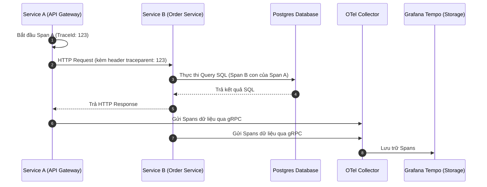

# 03 - Quản Trị Log Tập Trung & Distributed Tracing

> Kết nối chuỗi dữ liệu từ log chi tiết đến bản đồ dấu vết cuộc gọi phân tán (Distributed Tracing) bằng Grafana Loki và OpenTelemetry.

---

## 1. Quản Trị Log Hiện Đại: Grafana Loki Thay Thế ElasticSearch

Trước đây, kiến trúc ELK (Elasticsearch, Logstash, Kibana) chiếm ưu thế nhưng rất nặng nề, đòi hỏi cụm máy chủ RAM lớn (thường tốn hàng ngàn USD/tháng).
**Grafana Loki** ra đời với triết lý như Prometheus:
* **Chỉ đánh index các nhãn metadata** (`app`, `env`, `namespace`).
* Toàn bộ nội dung thô của Log được nén và đẩy thẳng lên Object Storage (S3/MinIO), tiết kiệm 80-90% chi phí lưu trữ.

### Cú Pháp Truy Vấn LogQL Cơ Bản Trên Grafana
```logql
# 1. Tìm toàn bộ log có chứa chữ "ERROR" hoặc "Exception" của backend-api
{app="backend-api", namespace="production"} |= "ERROR"

# 2. Parse cấu trúc JSON và lọc các log có thời gian query Database > 1000ms
{app="backend-api"} | json | db_latency_ms > 1000

# 3. Đếm số lượng dòng log ERROR mỗi phút (biến Log thành Metric biểu đồ)
sum(count_over_time({app="backend-api"} |= "ERROR" [1m]))
```

---

## 2. Distributed Tracing Với OpenTelemetry (OTel)

Khi hệ thống chuyển đổi từ Monolith sang Microservices, một request từ Client có thể phải đi qua nhiều service khác nhau:
`Client -> API Gateway -> Auth Service -> Order Service -> Payment Service`

### 2.1 Chuẩn Truyền Tải W3C TraceContext
Để liên kết các hành động phân tán này, các service phải truyền tải header tiêu chuẩn `traceparent` qua HTTP hoặc gRPC metadata:
```text
traceparent: 00-4bf92f3577b34da6a3ce929d0e0e4736-00f067aa0ba902b7-01
              │  └──────────────┬───────────────┘ └───────┬──────┘ └─┬┘
              │             Trace ID                   Parent ID    Flags
           Version                                     (Span ID)
```
* **Trace ID:** Một chuỗi ngẫu nhiên duy nhất đại diện cho toàn bộ hành trình của một request. Mọi service tham gia xử lý request đều mang chung `Trace ID` này.
* **Span ID:** Đại diện cho một bước xử lý con (ví dụ: thời gian thực hiện câu lệnh SQL, thời gian gọi Redis, thời gian mã hóa mật khẩu).

### 2.2 Luồng Dữ Liệu OpenTelemetry


Khi có Trace ID, kỹ sư mở **Grafana Tempo** hoặc **Jaeger** để xem biểu đồ Gantt Chart: Biết chính xác trong tổng thời gian 3.5 giây xử lý, service nào chiếm bao nhiêu mili-giây và câu lệnh SQL nào là điểm nghẽn.
